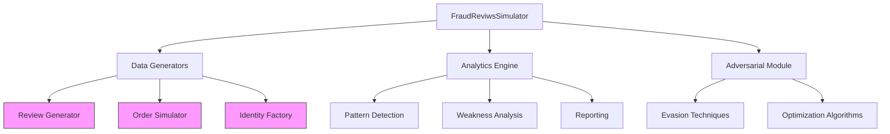

# FraudReviwsSimulator - E-commerce Fraud Simulation Toolkit

[](https://www.python.org/)
[](LICENSE)


FraudReviwsSimulator is a sophisticated Python toolkit designed for simulating e-commerce fraud patterns and testing detection systems. It generates realistic fake reviews, fraudulent orders, and synthetic identities to help developers, security researchers, and e-commerce platforms build robust fraud prevention systems.

## 🔥 Key Features

- **Multi-Vector Fraud Simulation**:
  - ✨ Fake review generation with adjustable suspiciousness levels
  - 💳 Fraudulent order patterns (card testing, account takeover, triangulation, refund abuse)
  - 👤 Synthetic identity creation with digital footprints
  - ⚔️ Adversarial evasion techniques
  
- **Realistic Data Generation**:
  - 📱 Device fingerprinting
  - 🌍 Geolocation-aware IP addresses
  - 💳 Valid test payment data
  - 📊 Behavioral patterns
  - ⏱️ Temporal anomaly simulation

- **Advanced Capabilities**:
  - 🔍 Fraud pattern detection
  - 🛡️ Data anonymization for privacy compliance
  - ⚙️ Customizable fraud patterns
  - 🧪 Adversarial optimization
  - 📈 Explainable AI outputs

- **Enterprise Ready**:
  - 🐳 Docker/Kubernetes support
  - 🔁 CI/CD integration
  - ✅ Comprehensive test suite
  - 📊 Detailed analytics dashboard
  - 🔌 API emulation mode

## 🚀 Quick Start

### 1. Basic Simulation
```bash
# Clone repository
git clone https://github.com/omarabdulah/fraudreviwssimulator.git
cd fraudreviwssimulator

# Install dependencies
pip install -r requirements.txt

# Run demo
python main.py
```

### 2. Generate Specific Data
```py
from core.reviews import ReviewGenerator
from core.orders import OrderSimulator
from core.identities import IdentityFactory
import json

# Generate high-suspicious reviews
review_gen = ReviewGenerator()
reviews = review_gen.generate("iPhone 15 Pro", suspiciousness="high", count=3)

# Save to file
with open("high_risk_reviews.json", "w") as f:
    json.dump(reviews, f, indent=2)

# Simulate card testing fraud
order_sim = OrderSimulator()
orders = order_sim.generate(fraud_type="card_testing", count=5)

# Save to file
with open("card_testing_orders.json", "w") as f:
    json.dump(orders, f, indent=2)

# Create synthetic identities
identity_factory = IdentityFactory()
identities = [identity_factory.create_identity("burner") for _ in range(3)]

# Save to file
with open("synthetic_identities.json", "w") as f:
    json.dump(identities, f, indent=2)

```
### 3. CLI Data Generation
```bash
# Generate 100 card testing orders
python -m cli generate_orders --type card_testing --count 100 --output card_testing_100.json

# Create 50 synthetic identities
python -m cli generate_identities --persona burner --count 50 --output burner_identities.json

# Generate 200 medium-suspicious reviews
python -m cli generate_reviews --product "Designer Watch" --suspiciousness medium --count 200 --output watch_reviews.json
```

### 4. Test Fraud Evasion
```py
from core.adversarial import FraudEvasionEngine
import json

# Load sample order
with open("fraud_order.json") as f:
    original_order = json.load(f)

# Create evasion engine
evasion_engine = FraudEvasionEngine()

# Show original detection score
original_score = evasion_engine.detection_model(original_order)
print(f"Original fraud score: {original_score:.2f}")

# Optimize order to evade detection
evaded_order, new_score = evasion_engine.optimize(original_order)

print(f"Evaded fraud score: {new_score:.2f}")

# Save evaded order
with open("evaded_order.json", "w") as f:
    json.dump(evaded_order, f, indent=2)

# Show modified fields
print("\nModified fields:")
for key in original_order:
    if original_order[key] != evaded_order.get(key):
        print(f"  {key}: {original_order[key]} → {evaded_order[key]}")
```

### 5. Fraud Detection Audit
```py
from core.analysis import FraudDetectionAuditor
import json

# Load your fraud detection API client
# (Mock implementation shown)
class FraudDetectionAPI:
    def score_order(self, order):
        # Your actual fraud scoring logic
        return random.random()  # Replace with real API call

# Create auditor
auditor = FraudDetectionAuditor(FraudDetectionAPI())

# Run comprehensive audit
report = auditor.run_simulation(
    test_cases=1000,
    fraud_distribution={
        "card_testing": 0.4,
        "account_takeover": 0.3,
        "triangulation": 0.2,
        "refund_abuse": 0.1
    },
    output_format="html"
)

# Save and display report
report.save("audit_report.html")
report.show_summary()

# Get performance metrics
metrics = report.calculate_metrics()
print(f"Detection Accuracy: {metrics['accuracy']:.2%}")
print(f"False Positive Rate: {metrics['false_positive_rate']:.2%}")
```

## 🐳 Docker Deployment
### 1. Build and Run Container
```bash 
# Build Docker image
docker build -t fraudreviwssimulator .

# Run container with volume for data persistence
docker run -v $(pwd)/data:/app/data fraudreviwssimulator

# Run specific command
docker run fraudreviwssimulator python -m examples.evasion_demo
```
### 2. Generate Test Data in Container
```bash
# Generate test dataset
docker run -v $(pwd)/data:/app/data fraudreviwssimulator \
  python -m cli generate_orders \
  --type account_takeover \
  --count 500 \
  --output /app/data/ato_orders.json

# Create identity dataset
docker run -v $(pwd)/data:/app/data fraudreviwssimulator \
  python -m cli generate_identities \
  --persona sleeper_agent \
  --count 200 \
  --output /app/data/sleeper_identities.json
  ```
  ### 3. Docker Compose Setup
  ```bash
  # docker-compose.yml
version: '3.8'
services:
  fraudsim:
    build: .
    volumes:
      - ./data:/app/data
    command: python main.py
```
## 🧪 Testing Your System
### 1. Generate Test Dataset
```bash
# Generate 1000 mixed fraud orders
python -m cli generate_orders \
  --mixed \
  --count 1000 \
  --output test_dataset.json

# Breakdown:
# - 40% card testing (400 orders)
# - 30% account takeover (300 orders)
# - 20% triangulation (200 orders)
# - 10% refund abuse (100 orders)
```

### 2. Run Fraud Detection Audit
```bash
# Audit your detection system
python -m cli run_audit \
  --input test_dataset.json \
  --api-url https://your-fraud-api/detect \
  --api-key YOUR_API_KEY \
  --output audit_results.html
```

### 3. Test Evasion Techniques
```bash # Test evasion against sample orders
python -m cli test_evasion \
  --input high_risk_orders.json \
  --output evasion_results.json \
  --iterations 50
```

### 4. Performance Benchmark
```bash # Benchmark fraud detection performance
python -m cli benchmark \
  --input test_dataset.json \
  --api-url https://your-fraud-api/detect \
  --threads 8 \
  --output benchmark_results.json
```

## 🧩 Architecture Overview


## Data Flow
* Configuration: Load fraud patterns from YAML files

* Template Rendering: Use Jinja2 templates with Faker data

* Synthetic Generation: Create reviews, orders, identities

* Adversarial Optimization: Modify data to evade detection

* Analysis: Evaluate detection system performance

* Reporting: Generate visual and statistical reports

## 🤖 Ethical Guidelines

### Permitted Use Cases
✅ Security research and education

✅ Fraud detection system development

✅ Defensive security testing

✅ Compliance validation (GDPR/CCPA)

### Strictly Prohibited
❌ Unauthorized testing of production systems

❌ Malicious attacks against any platforms

❌ Generation of real payment data

❌ Identity theft or impersonation

## 📂 Project Structure

```text
fraud_reviws_simulator/
├── core/               # Main simulation modules
├── configs/            # Fraud pattern configurations
├── templates/          # Jinja2 templates
├── examples/           # Usage examples
├── tests/              # Comprehensive test suite
├── utils/              # Helper functions
├── cli.py              # Command line interface
├── Dockerfile          # Container configuration
├── requirements.txt    # Dependencies
└── main.py             # Entry point
```

## 📈 Testing & Coverage
```bash # Run comprehensive test suite
pytest --cov=core --cov=utils --cov-report=html tests/

# View coverage report (85-95% coverage)
open htmlcov/index.html
```
## 🤝 Contributing
1. Fork the repository

2. Create feature branch (git checkout -b feature/your-feature)

3. Commit changes (git commit -am 'Add awesome feature')

4. Push to branch (git push origin feature/your-feature)

5. Open pull request


## 📜 License
MIT License - see [LICENSE](LICENSE) for details.
